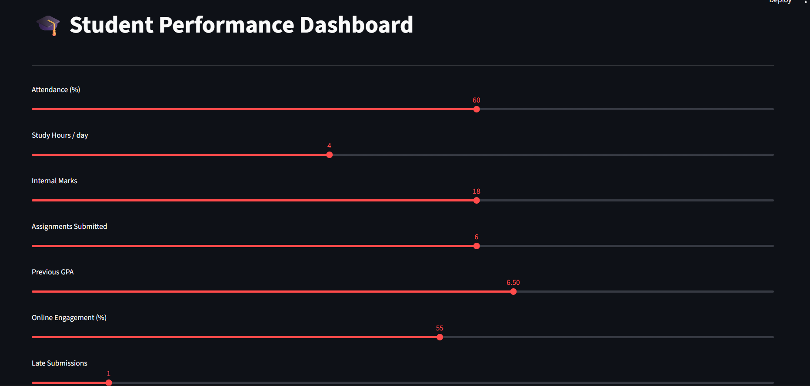
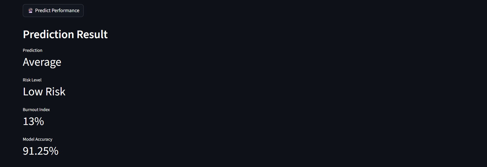
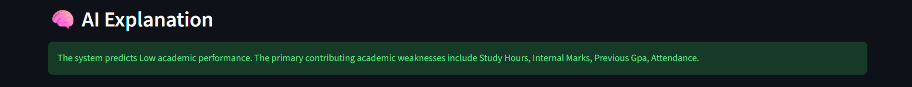
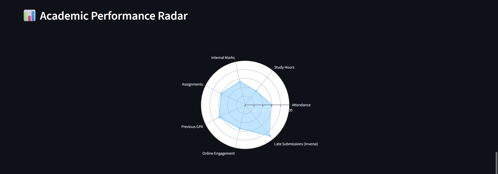

# Student Performance Prediction System

AI-based system to predict student academic performance using Machine Learning.

## Features
- Random Forest ML model
- Burnout Index calculation
- Risk Level prediction
- SHAP AI explanation
- Streamlit Dashboard
- PDF Report Generation

## Tech Stack
Python
Flask
Streamlit
Scikit-learn
Plotly
SHAP

## Run Project

Install dependencies:

pip install -r requirements.txt

Run backend:

python app.py

Run dashboard:

streamlit run frontend.py

## Project Output

### Dashboard

### Prediction Result

### AI Explanation

### Performance Radar Chart

